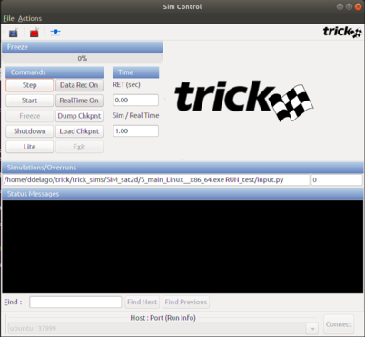

# NASA-Trick-Web-Server (TWS)
A NodeJS server that communicates with the Trick simulation software and exposes its variables to the web using a REST interface.  

## Getting Started
1. Install NodeJs from [NodeJs Official Page](https://nodejs.org/en) which should come bundled with npm if you do not have it already.
2. Install Trick from the [Open Source Trick repository](https://github.com/nasa/trick) then [compile and run a simulation](https://github.com/nasa/trick/wiki/ATutAnalyticSim). 
	An easier way to do this is to just compile and run a premade simulation:
	``` bash
	cd ~/trick/trick_sims/SIM_sat2d
	# Below trick executable should be in your path after following the installation instructions
	trick-CP
	# ~~ Simulation Builds ~~
	./S_main_Linux__x86_64.exe RUN_test/input.py
	# Simulation starts and Sim Control window appears
	```  
3. Open Terminal
4. Clone the repository. 
	``` bash
	git clone https://github.com/ddelago/NASA-Trick-Web-Server.git
	```
5. Change into the project directory
	``` bash
	cd NASA-Trick-Web-Server
	```
6. Install all dependencies.
	``` bash
	npm install
	```
7. Find the address and port of a Trick simulation that you want to connect to. Look at the bottom of the Sim Control window.
	
8. Run the following command to start the server
	``` bash
	npm start {trick address} {trick port}
	# Example 
	npm start 139.169.172.213 37999
	```
	
## Data Channel Servers

 Data Channel Servers provide a variety of potentially realtime JSON data to web clients. These servers have a simple API for querying & accessing data. Data is sent via REST responses or over a WebSocket 'channel stream'.

__Channels__

All data available from Data Channel Servers have a unique identifier called a 'channel'. Channel names are formatted as absolute paths i.e. `/car/battery/voltage`. The `/` character is used to organize channels into hierarchies  which adds structure to the data. Every channel has an API endpoint on the server that is identical to its channel name . There are also endpoints defined for every channel segment in the channel name as well i.e `/car`, `/car/battery`, and finally `/car/battery/voltage`. 


## REST API
The API can be accessed at the `/data` endpoint by using the following HTTP methods:

* [OPTIONS](#options) - Lists information about available channels
* [GET/POST](#get/post) - Returns channel objects
* [PUT](#put) - Adds channel objects to the channel stream
* [DELETE](#delete) - Removes channel objects from the channel stream
* [Batch Requests](#batch-requests) - Bundles mulitple requests into a single request


### Example

In the following examples we will use a Data Channel Server that provides the following 6 data channels:
* /comp/os
* /comp/cpu/speed
* /comp/cpu/temp
* /comp/ram/size
* /comp/ram/usage/free
* /comp/ram/usage/used

These examples demonstrate the request/response exchange between the Data Channel Server and its clients.


### OPTIONS
---
**OPTIONS** `http://localhost/data/comp/*`
</br>*The * wildcard returns all immediate child channel segments*
```js
HTTP Response:
[
    "os"
    "cpu/"
    "ram/"
]
```
**OPTIONS** `http://localhost/data/comp/**`
</br>*The ** wildcard returns all child channel segments recursively*
```js
HTTP Response:
[
    "os"
    "cpu/"
    "cpu/speed"
    "cpu/temp"
    "ram/"
    "ram/size"
    "ram/usage/"
    "ram/usage/free"
    "ram/usage/used"
]
```

### GET/POST
---
**GET** `http://localhost/data/comp/cpu/temp`
</br>*Returns the channel object for channel `/comp/cpu/temp`.</br>When a client receives channel data from the server (either by GET request or via a channel stream) it arrives as a JSON object in the following 'channel object' format:*
```js
HTTP Response:
{
    "channel": "/comp/cpu/temp",
    "data": 55
}
```

POST is used for [batch requests](#batch-requests).
A POST request is a collection of GET requests.

### PUT
---
**PUT** `http://localhost/data/comp/cpu/temp`
</br>*Will add the channel object for `/comp/cpu/temp` to the channel stream.
</br>This will add the same channel object as returned in **GET** ` http://localhost/data/comp/cpu/temp` to the channel stream. The HTTP response contains the channels that were successfully added to the channel stream. </br>Note: If channel has already been added to the channel stream, then the response array would be empty as no new channels would be added to the stream.*
```js
HTTP Response:
[
    "/comp/cpu/temp"
]
Channel Stream:
[
    {
        "channel": "/comp/cpu/temp",
        "data": 55
    }
]
```


**PUT** `http://localhost/data/comp/ram/usage/*`
</br>*Same as the previous PUT request except can apply to multiple __immediate__ sub channels.
</br>Will cause all channel objects matching the wildcard channel name (in this case `/comp/ram/size`) to be added to the channel stream.*

```js
HTTP Response:
[
    "/comp/ram/size",
]
Channel Stream:
[
    {
        "channel": "/comp/cpu/temp",
        "data": 55
    },
    {
        "channel": "/comp/ram/size",
        "data": "16GB"
    }
]
```
**PUT** `http://localhost/data/comp/ram/**`
</br>*Same as the previous PUT request except applys to sub channels __recursively__.
</br>Will cause all channel objects matching the wildcard channel name (in this case `/comp/ram/usage/free` and `/comp/ram/usage/used`) to be added to the channel stream.*

```js
HTTP Response:
[
    "/comp/ram/usage/free",
    "/comp/ram/usage/used"
]
Channel Stream:
[
    {
        "channel": "/comp/cpu/temp",
        "data": 55
    },
    {
        "channel": "/comp/ram/size",
        "data": "16GB"
    },
    {
        "channel": "/comp/ram/usage/free",
        "data": "12GB"
    },
    {
        "channel": "/comp/ram/usage/used",
        "data": "4GB"
    }
]
```

### DELETE
---

**DELETE** `http://localhost/data/comp/cpu/temp`
</br>*Will remove the channel object for channel `/comp/cpu/temp` from the channel stream*
```js
HTTP Response:
[
    "/comp/cpu/temp"
]
Data Stream:
[
    {
        "channel": "/comp/ram/usage/free",
        "data": "12GB"
    },
    {
        "channel": "/comp/ram/usage/used",
        "data": "4GB"
    }
]
```


**DELETE** `http://localhost/data/comp/ram/usage/*`
</br>**Same as the previous DELETE request except can apply to multiple channels.
</br>Will cause all channel objects matching the wildcard channel name (in this case `/comp/ram/usage/free` and `/comp/ram/usage/used`) to be removed from the channel stream*

```js
HTTP Response:
[
    "/comp/ram/usage/free",
    "/comp/ram/usage/used"
]
Data Stream:
[
    // Now Empty
]
```
### Batch Requests
---
PUT and DELETE can also use JSON payloads to support batch/bulk requests. Everything in the JSON body will processed as if it was an individual request. For example the single request:

**PUT** `http://localhost/data`
with a JSON payload of 
```js
JSON Payload:
{
    "/comp/cpu/temp",
    "/comp/ram/usage/*"
}
```
Has the same effect as the following 2 individual requests:</br>
**PUT** `http://localhost/data/comp/cpu/temp`</br>
**PUT** `http://localhost/data/comp/ram/usage/*`

POST can be used to do bulk GET requests.</br>
**POST** `http://localhost/data`
with a JSON payload of 
```js
JSON Payload:
{
    "/comp/cpu/temp",
    "/comp/ram/usage/used"
}
```
Produces the following response:
```js
HTTP Response:
[
    {
        "channel": "/comp/cpu/temp",
        "data": 55
    },
    {
        "channel": "/comp/ram/usage/used",
        "data": "4GB"
    }    
]
```
### Extra

There are also two more endpoints that I've created. 

**PUT** `http://localhost/cmd/clearVariables`
</br>*Will remove **ALL** channels from the stream, all variable data stored on the server, and all variables being sent from the Trick Simulation. This could be used to quickly remove everything without performing any logic.*

**POST** `http://localhost/cmd/comp/temp`
with a JSON payload of 
```js
JSON Payload:
{
	"value": 10
}
```
</br>*Will send the **trick.var_set("comp.temp",  10)** command to the Trick server to change the value of that variable. This allows for control of the simulation!*
